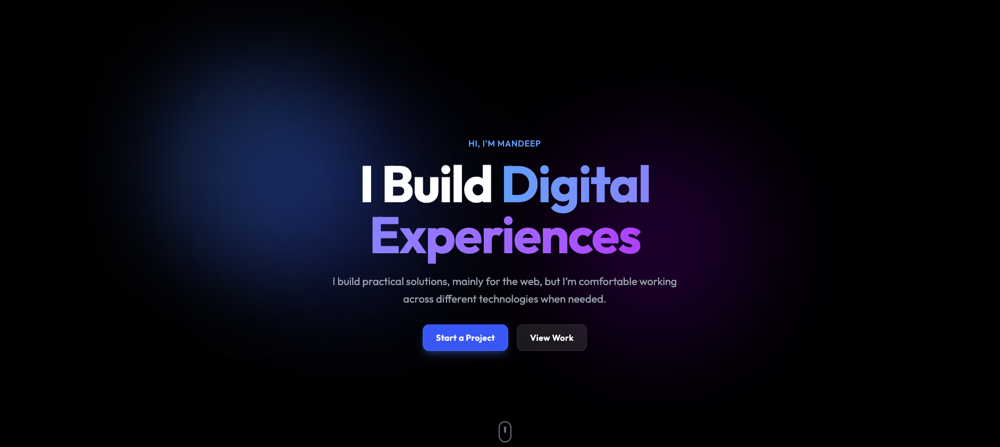
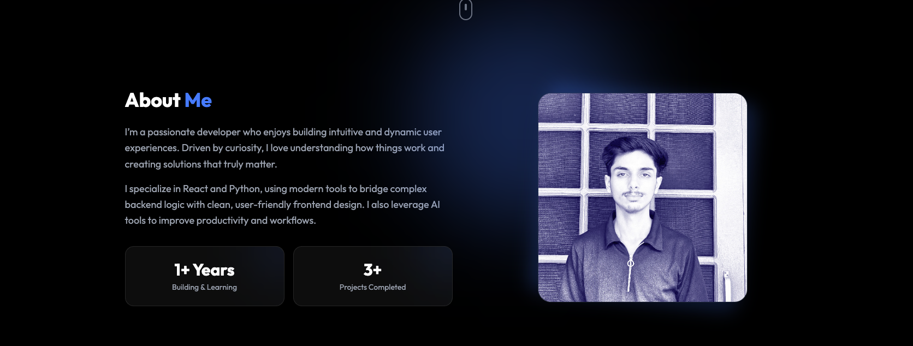
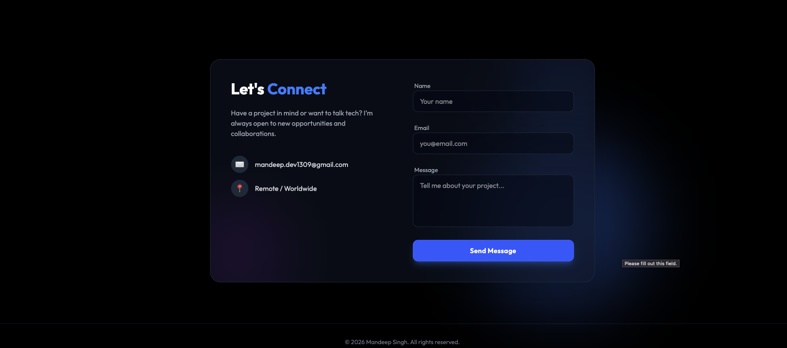

# Mandeep.dev Portfolio

Personal developer portfolio — a warm, light, editorial site with a CSS-3D depth
system. Built with React 19, Vite 7, Tailwind CSS 4 and framer-motion.

## Screenshots

| Hero | Projects |
| ---- | -------- |
|  |  |



## Stack

| Layer      | Choice                                              |
| ---------- | --------------------------------------------------- |
| UI         | React 19.2 (JavaScript/JSX, no TypeScript)           |
| Build      | Vite 7                                               |
| Styling    | Tailwind CSS 4 (CSS-first `@theme`, no config file)  |
| Animation  | framer-motion — CSS 3D, no WebGL or GSAP             |
| Forms      | EmailJS                                              |
| Linting    | ESLint                                               |
| Tests      | None                                                 |

## Getting started

```bash
pnpm install
pnpm dev       # http://localhost:5173/Mandeep.dev/
```

The app is served under the **`/Mandeep.dev/` base path** (GitHub Pages
subdirectory). Opening `http://localhost:5173/` directly will 404.

## Scripts

| Command       | Does                                              |
| ------------- | ------------------------------------------------- |
| `pnpm dev`    | Dev server with HMR and network access           |
| `pnpm build`  | Production build to `dist/`                       |
| `pnpm preview`| Serve the production build locally                |
| `pnpm lint`   | ESLint over the project                           |
| `pnpm deploy` | Publish `dist/` to GitHub Pages (`gh-pages`)      |

## Design system

Tokens live in the `@theme` block at the top of `src/index.css` — Tailwind v4 is
CSS-first, so there is no `tailwind.config.js`.

- **Surfaces** — `#faf9f6` page, `#f5f3ef` recessed, `#ffffff` elevated
- **Accents** — terracotta `#c25a3e`, slate `#4a6a7a`, amber `#d4895b`
- **Text** — `#2d2a24` primary, `#6b6560` secondary, `#9c958d` meta
- **Type** — Outfit (body), Clash Display (headings), JetBrains Mono (meta)

## Project layout

```
src/
├── App.jsx            composes sections, mounts the depth stage
├── index.css          @theme tokens + the CSS-3D depth system
├── assets/            images
├── data/portfolio.js  project entries
├── lib/               motion vocabulary, shared pointer values
├── pages/             standalone case-study routes
└── components/
    ├── common/        Footer
    ├── cursor/        CustomCursor
    ├── sections/      Hero, About, Projects, Contact, Social
    ├── three/         DepthStage, Tilt, FloatingChip  (CSS 3D, not three.js)
    └── ui/            Button, Card, Word3D
```

> `components/three/` is a naming convention only. There is no WebGL in this
> project.

## Accessibility & motion

Motion is a layer, never a precondition. Every animation has a
`prefers-reduced-motion` branch, content is real DOM text, and there are visible
focus rings with keyboard parity for hover interactions.

## Notes

`src/assets/blackloop_homepage.png` is ~4.3 MB and dominates the bundle. Worth
compressing to WebP/AVIF if load time matters.

The EmailJS public key in `src/components/sections/Contact.jsx` is committed by
design — it is a public, rate-limitable browser key. Don't add other secrets to
client code.